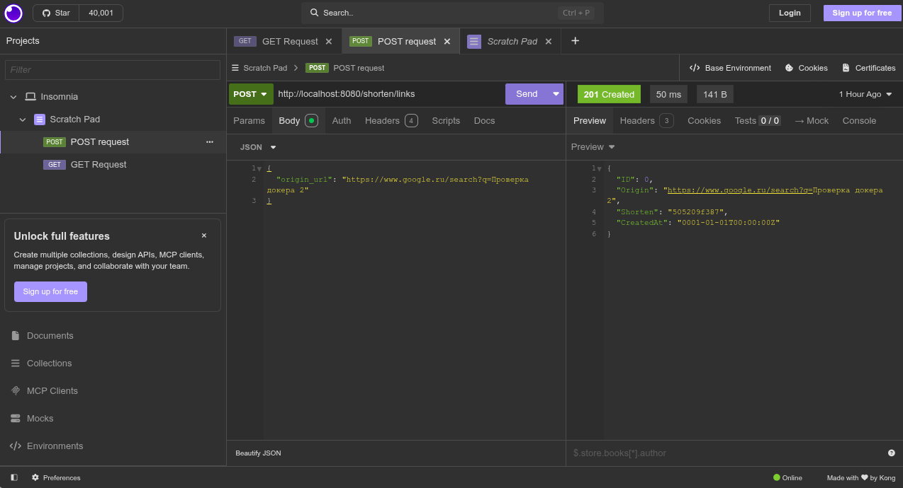
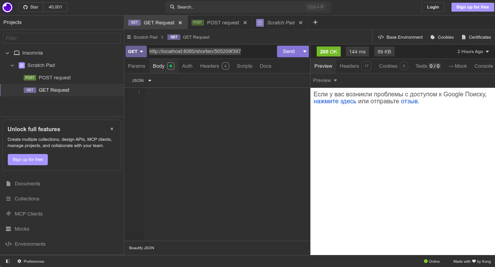

# Link shortener app
Helps you make your long URLs shorter.
## Features 
Uses PostgreSQL as main database and Redis as cache.

## Quick start
`git clone https://github.com/Andnail/linkshortener.git`

`cd linkshortener`

`docker-compose up`

## Usage
### 1. Getting a short link
App receives a JSON as it shown at the picture.





I'm using Insomnia to send a POST request with URL at JSON that have to be shorten. 

URL 
`http://localhost:8080/shorten/links`

JSON 
```
{
  "origin_url": "your link"
}
```
### 2. Redirecting 

For redirecting just follow link you received.
`http://localhost:8080/shorten/{Your shorten link}`




